# Fake News Detection mit Graph Neural Networks


> Erkennung von Fake News in sozialen Netzwerken durch Analyse von Propagationsmustern mit Graph Neural Networks (GCN, GraphSAGE, GAT).


---

## Inhaltsverzeichnis

- [Projektuebersicht](#projektuebersicht)
- [Datengrundlage](#datengrundlage)
- [Explorative Datenanalyse](#explorative-datenanalyse)
- [Klassisches Machine Learning](#klassisches-machine-learning)
- [Graph Neural Networks](#graph-neural-networks)
- [Projektstruktur](#projektstruktur)
- [Technologie-Stack](#technologie-stack)
- [Setup](#setup)

---

## Projektuebersicht

Fake News verbreiten sich in sozialen Netzwerken oft schneller als verifizierte Nachrichten. Die Erkennung solcher Falschmeldungen ist eine zentrale Herausforderung fuer die Integritaet digitaler Informationssysteme. Waehrend viele bestehende Ansaetze ausschliesslich auf der textuellen Analyse von Nachrichteninhalten basieren, verfolgt dieses Projekt einen **graphbasierten Ansatz**: Anstatt nur den Text einer Nachricht zu untersuchen, wird analysiert, **wie** sich eine Nachricht ueber ein soziales Netzwerk ausbreitet und **wer** an dieser Verbreitung beteiligt ist.

Jedes News-Item wird als **Propagation Graph** modelliert, in dem der Wurzelknoten den Ursprungspost repraesentiert und nachgelagerte Knoten die Twitter-Nutzer darstellen, die den Inhalt weiterverbreiten. Kanten bilden die Verbreitungsbeziehungen (z.B. Retweets) ab. Auf dieser Struktur werden sowohl klassische Machine-Learning-Methoden als auch **Graph Neural Networks (GCN, GraphSAGE, GAT)** trainiert, um eine binaere Klassifikation in *fake* vs. *real* durchzufuehren.

Das Projekt zeigt, dass GNNs innerhalb einer Domaene mit bis zu **97.6% Accuracy** auf GossipCop klassifizieren koennen, waehrend klassische ML-Modelle als solide Baseline mit ~90% Accuracy dienen. Gleichzeitig wird die Herausforderung der Cross-Domain-Generalisierung systematisch untersucht und diskutiert.

---

## Datengrundlage

Als Datenbasis dient das **UPFD-Dataset** (User Preference-aware Fake News Detection), basierend auf dem FakeNewsNet-Repository. Die Daten liegen bereits als Propagation-Graphen mit Labels (fake/real) und vorverarbeiteten Knotenfeatures vor.

| Eigenschaft | GossipCop | PolitiFact |
|---|---|---|
| **Domaene** | Entertainment / Promi-News | Politik |
| **Anzahl Graphen** | 5.464 | 314 |
| **Knoten (gesamt)** | 314.262 | 41.054 |
| **Kanten (gesamt)** | 308.798 | 40.740 |
| **Avg. Knoten / Graph** | ~58 | ~131 |
| **Klassenverteilung** | 50/50 (fake/real) | 50/50 (fake/real) |

### Feature-Varianten

| Feature-Typ | Dimension | Beschreibung |
|---|---|---|
| **profile** | 10D | Profilattribute eines Twitter-Accounts |
| **spacy** | 300D | Word2Vec-Embedding aus historischen Tweets (spaCy) |
| **bert** | 768D | Embedding aus historischen Tweets (BERT) |
| **content** | 310D | Kombination aus spacy (300D) + profile (10D) |

Zusaetzlich wurden **strukturelle Features** (Topologie-Metriken), **aggregierte Inhaltsfeatures** und **Bot-Indikatoren** (Botometer X) als ergaenzende Merkmale erzeugt.

---

## Explorative Datenanalyse

### Graphstrukturen und Verteilungen

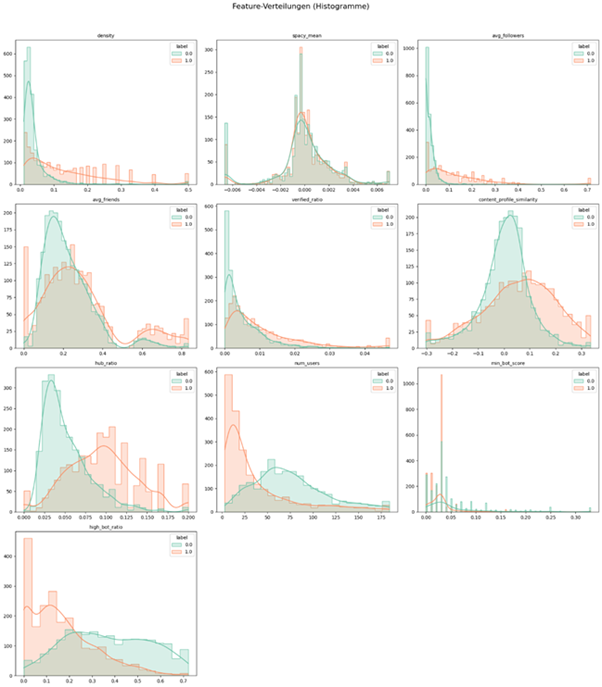

*Verteilung der selektierten Features nach VIF-Reduktion (33 auf 11 Features), getrennt nach Label (fake/real). Mehrere Merkmale zeigen komplementaere Trennungstendenzen -- z.B. groessere Propagationsnetzwerke (num_users) bei echten Nachrichten und hoehere Netzwerkdichte bei Fake News.*

### Feature Embeddings

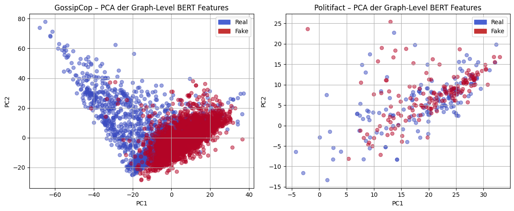

*PCA-Projektion der Graph-Level-BERT-Embeddings, getrennt nach Datensatz. GossipCop zeigt eine deutlich groessere Streuung in der 2D-Projektion, waehrend PolitiFact kompakter zusammenliegt -- ein Hinweis auf unterschiedliche Varianzstrukturen zwischen den Domaenen.*

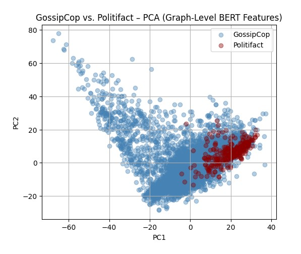

*Gemeinsame PCA-Projektion beider Datensaetze. Die klare raeumliche Trennung zwischen GossipCop und PolitiFact verdeutlicht die fundamentalen inhaltlichen und repraesentationellen Unterschiede, die spaeter die Cross-Domain-Generalisierung erschweren.*

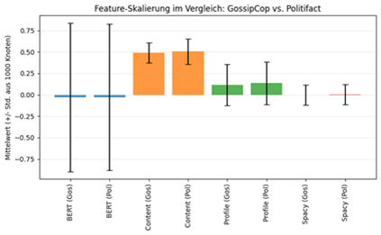

*Vergleich von Mittelwert und Standardabweichung der vier Feature-Varianten (BERT, spacy, content, profile) zwischen GossipCop und PolitiFact. BERT-Embeddings zeigen die hoechste Streuung, waehrend Content-Features einen positiven Offset aufweisen -- unterschiedliche Skalierungen, die eine Normalisierung vor dem Training erfordern.*

### Beispielgraphen

| GossipCop | PolitiFact |
|---|---|
| 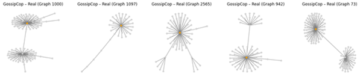 | 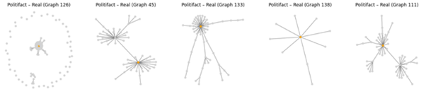 |
| 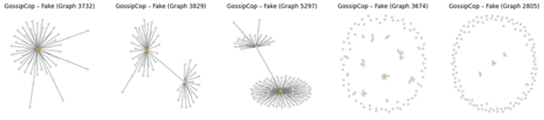 | 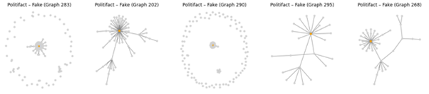 |

*Einzelne Propagation Graphs aus beiden Datensaetzen. Die visuellen Netzwerkgrafiken zeigen sowohl bei echten als auch bei gefaelschten Nachrichten aehnliche Grundstrukturen -- eine rein visuelle Unterscheidung ist nicht zuverlaessig moeglich. Trennschaerfe entsteht erst ueber aggregierte Muster vieler Graphen.*

---

## Klassisches Machine Learning

Vor dem Einsatz von GNNs werden klassische ML-Modelle als **Baseline** evaluiert. Dafuer werden die Graphdaten zu Graph-Level-Feature-Vektoren aggregiert (33 Features, nach VIF-Selektion auf 11 reduziert). Trainiert werden **Logistic Regression**, **Random Forest**, **XGBoost** und **SVM** mit stratifizierter Cross-Validation.

### Ergebnisse GossipCop

| Modell | Test Accuracy | Test F1 | Test ROC-AUC | CV ROC-AUC | Overfitting Gap |
|---|---|---|---|---|---|
| **XGBoost** | 0.897 | 0.895 | **0.958** | 0.951 | 3.2% |
| Random Forest | 0.899 | 0.899 | 0.957 | 0.945 | 3.1% |
| SVM | 0.897 | 0.895 | 0.955 | 0.945 | 0.8% |
| Logistic Regression | 0.867 | 0.863 | 0.936 | 0.929 | 0.1% |

Selbst das lineare Modell erreicht 86.7% Accuracy -- die aggregierten Features trennen die Klassen also messbar. XGBoost erzielt den besten ROC-AUC (0.958), waehrend alle Modelle niedrige Overfitting-Gaps aufweisen.

### Ergebnisse PolitiFact

| Modell | Test Accuracy | Test F1 | Test ROC-AUC | CV ROC-AUC | Overfitting Gap |
|---|---|---|---|---|---|
| **SVM** | 0.714 | 0.763 | **0.850** | 0.783 | 7.4% |
| XGBoost | 0.714 | 0.710 | 0.834 | 0.812 | 2.6% |
| Random Forest | 0.730 | 0.730 | 0.802 | 0.812 | 9.6% |
| Logistic Regression | 0.683 | 0.737 | 0.790 | 0.780 | 3.3% |

Bei PolitiFact (nur 314 Graphen) liegt die Performance bei ~70-73% Accuracy. SVM erzielt den besten ROC-AUC (0.85), XGBoost generalisiert am stabilsten mit nur 2.6% Overfitting Gap.

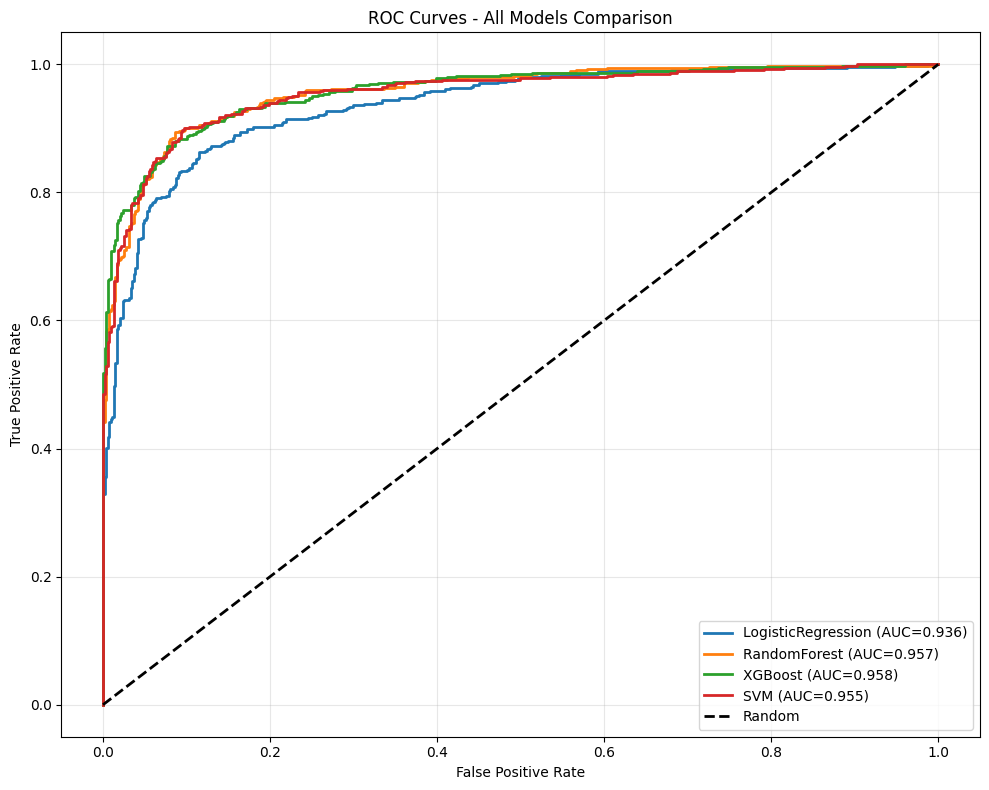

*ROC-Kurven der klassischen ML-Modelle auf GossipCop. Alle Modelle erreichen AUC-Werte ueber 0.93, wobei XGBoost (0.958) und Random Forest (0.957) nahezu identisch abschneiden. Die Kurven zeigen, dass die aggregierten Graph-Features eine robuste Klassentrennung ermoeglichen.*

### Feature Importance

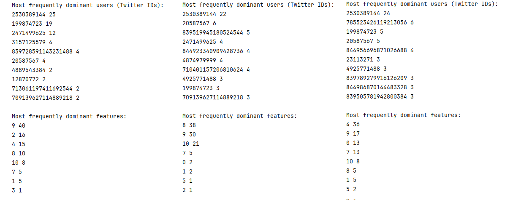

*Node- und Feature-Importance der drei besten GNN-Parametersets (links: Set 1, Mitte: Set 2, rechts: Set 3). Die Modelle unterscheiden sich in ihren dominanten Features: Set 1 fokussiert auf einzelne Nutzer, waehrend Set 2 und 3 staerker auf interpretierbare Features wie bot_score und statuses_count setzen.*

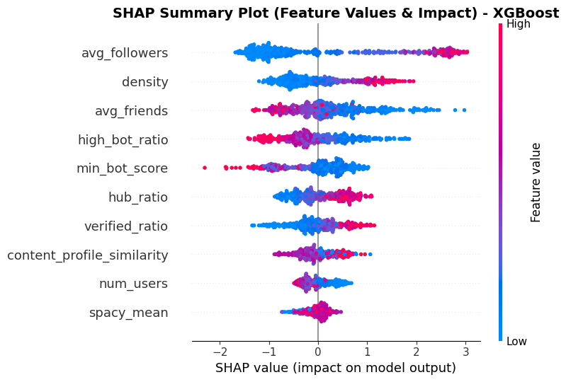

*SHAP Summary Plot des XGBoost-Modells auf GossipCop. Jeder Punkt repraesentiert ein News-Item; die Farbe zeigt den Feature-Wert (rot = hoch, blau = niedrig). Hohe avg_followers-Werte schieben die Vorhersage Richtung "Fake News" -- Falschmeldungen werden haeufig von Accounts mit grosser Reichweite verbreitet.*

### Cross-Domain Evaluation

| Training | Test | Accuracy | ROC-AUC |
|---|---|---|---|
| GossipCop | GossipCop | 89.7% | 0.958 |
| GossipCop | **PolitiFact** | **45.2%** | **0.380** |

Das auf GossipCop trainierte Modell **generalisiert nicht** auf PolitiFact (ROC-AUC 0.38, unter Random-Baseline). Die aggregierten Graph-Features sind stark domaenenspezifisch -- Entertainment- und Politik-Nachrichten unterscheiden sich fundamental in Verbreitungsmustern und Nutzergruppen.

---

## Graph Neural Networks

### Architektur

Graph Neural Networks verarbeiten die Propagation-Graphen direkt, ohne Aggregation zu Tabellen. Jeder Knoten sammelt iterativ Informationen von seinen Nachbarn (Message Passing) und bildet so eine latente Repraesentations, die sowohl eigene Eigenschaften als auch die Netzwerkstruktur kodiert.

Drei GNN-Architekturen wurden evaluiert:

| Architektur | Mechanismus |
|---|---|
| **GCN** | Graph Convolutional Network -- gewichtete Mittelung der Nachbarschaftsfeatures |
| **GraphSAGE** | Sampling und Aggregation der Nachbarschaft -- skalierbar auf grosse Graphen |
| **GAT** | Graph Attention Network -- lernbare Aufmerksamkeitsgewichte pro Nachbar |

Das **Hyperparameter-Tuning** erfolgte mit **Weights & Biases** (Bayesian Sweep, 200 Konfigurationen) auf einer Nvidia Titan RTX GPU. Optimiert wurden u.a. Anzahl Layers (2-4), Hidden Channels (32-128), Dropout, Pooling-Methode, Learning Rate und Batch Size.

### Ergebnisse GossipCop

Die drei besten Parametersets nach Hyperparameter-Tuning:

| Set | Architektur | Layers | Accuracy GossipCop |
|---|---|---|---|
| Set 1 | GraphSAGE | 2 | **97.25%** |
| Set 2 | GraphSAGE | 4 | **97.44%** |
| Set 3 | GAT | 3 | **97.62%** |

Alle Top-Modelle verwenden **AdamW**, **BatchNorm**, **128 Hidden Channels** und **Max-Pooling**. Die Fehlerquote liegt bei nur 13-15 von 546 Testgraphen -- ein deutlicher Sprung gegenueber der ML-Baseline (~90%).

### GNN Training

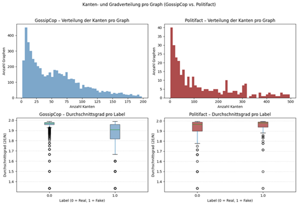

*Verteilung der Kanten pro Graph fuer GossipCop und PolitiFact. Die stark rechtsschiefe Verteilung zeigt: Die meisten News-Items erzeugen wenige Interaktionen, waehrend einzelne Graphen sehr gross werden. PolitiFact weist breitere Spannweiten auf -- politische Inhalte loesen haeufiger groessere Diffusionsnetzwerke aus.*

### Cross-Domain-Transfer der GNNs

| Set | Accuracy GossipCop | Accuracy PolitiFact |
|---|---|---|
| Set 1 | 97.3% | 53.5% |
| Set 2 | 97.4% | 52.2% |
| Set 3 | 97.6% | 50.0% |

Auch die GNNs generalisieren **nicht** ueber Domaenen hinweg. Mit Masking (10% Feature-Masking, 5% Edge-Dropout) als zusaetzlicher Regularisierung verbessert sich die Cross-Domain-Performance nicht.

### Gemeinsames Training (GossipCop + PolitiFact)

| Set | Accuracy GossipCop | Accuracy PolitiFact |
|---|---|---|
| Set 1 | 91.2% | 75.8% |
| Set 2 | **96.2%** | **85.5%** |
| Set 3 | 81.8% | 79.0% |

Durch gemeinsames Training mit Domänen-Weighting erreicht das beste Modell (Set 2) **96.2% auf GossipCop** und **85.5% auf PolitiFact** -- ein tragfaehiger Kompromiss zwischen Domaenenspezialisierung und Generalisierung.

### Explainability

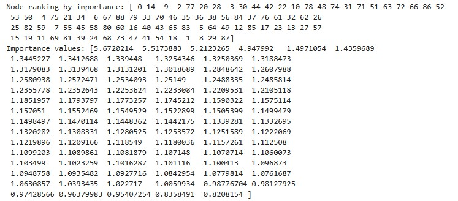

*Node-Importance-Analyse eines einzelnen Propagation Graphs. Das Modell fokussiert primaer auf wenige Schluesselknoten, wobei der Wurzelknoten (ID 0, der Account, der die News gepostet hat) als wichtigster Knoten erkannt wird -- ein intuitiv nachvollziehbares Verhalten.*

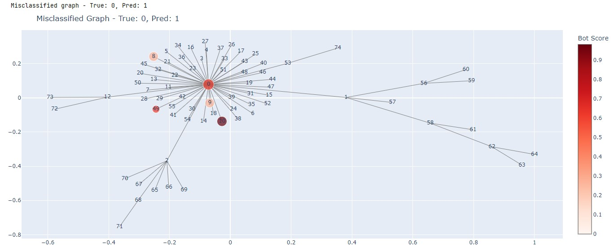

*Fehlklassifizierter Graph (Farbe = Bot-Score, Groesse = Modell-Wichtigkeit). Typische Fehlklassifikationen betreffen echte Posts von nicht vertrauenswuerdigen Nutzern oder Fake News von eigentlich vertrauenswuerdigen Quellen -- Grenzfaelle, in denen Struktur- und Profilsignale widerspruechlich sind.*

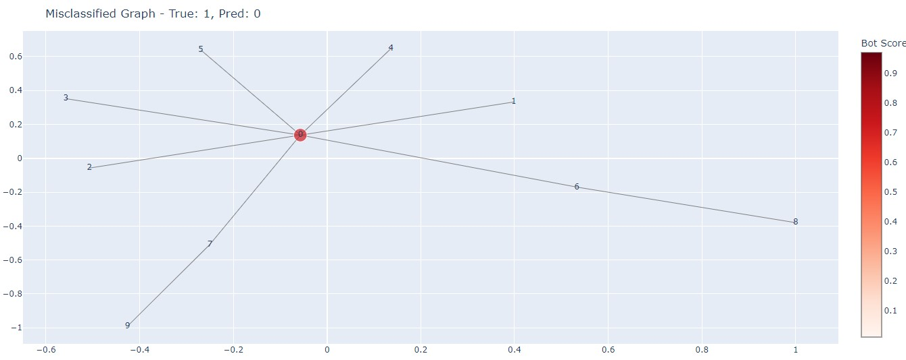

*Weiteres Beispiel einer Fehlklassifikation. Der ueberrepraesentierte Nutzer 2530389144 (ein indonesisches Nachrichtenportal, das automatisiert postete) taucht haeufig in fehlklassifizierten Netzwerken auf -- ein Hinweis auf potenzielle Verzerrung durch dominante Akteure im Datensatz.*

### Nutzeranalyse

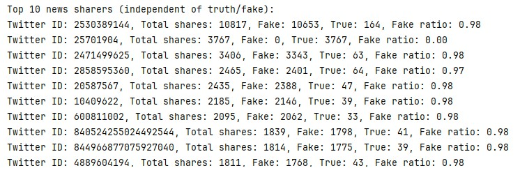

*Die praevanlentesten Nutzer im GossipCop-Datensatz, aufgeteilt nach Interaktion mit Fake News (rot) und echten Nachrichten (blau). Einzelne Nutzer wie 2530389144 dominieren den Datensatz mit ueber 10.000 Vorkommen -- ein suspendierter automatisierter Account eines indonesischen Nachrichtenportals.*

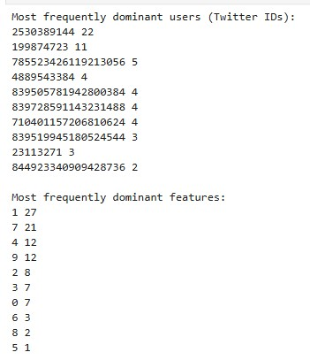

*Top-10 der wichtigsten Nutzer und Features ueber 100 Netzwerke. Dominante Features sind geo_enabled (Feature 1) und months_since_twitter_launch (Feature 7) -- beide intuitiv relevant als Bot-Indikatoren, da automatisierte Accounts oft keine Geo-Lokalisierung haben und haeufig kurzlebig sind.*

---

## Projektstruktur

```
fakenews-gnn-detection/
├── src/
│   ├── models/              # GNN-Modelle (GCN, GraphSAGE, GAT)
│   └── utils/               # Datenverarbeitung, Evaluation, Features
├── notebooks/               # EDA, Training, Experimente
│   ├── EDA.ipynb
│   ├── SimpleML.ipynb
│   ├── Fakenews_GNN.ipynb
│   └── Fakenews_GNN_Final.ipynb
├── data/                    # UPFD-Datensaetze
├── img/                     # Visualisierungen und Plots
├── tests/                   # Unit Tests
├── utils/                   # Hilfsfunktionen
├── requirements.txt         # Abhaengigkeiten
└── README.md
```

---

## Technologie-Stack

| Kategorie | Technologien |
|---|---|
| **Deep Learning** | PyTorch, PyTorch Geometric (PyG) |
| **Klassisches ML** | scikit-learn, XGBoost |
| **NLP / Embeddings** | BERT, spaCy |
| **Experiment Tracking** | Weights & Biases |
| **Datenanalyse** | pandas, NumPy, NetworkX |
| **Visualisierung** | matplotlib, seaborn |
| **Bot-Erkennung** | Botometer X |

---

## Setup

```bash
# Repository klonen
git clone https://github.com/username/fakenews-gnn-detection.git
cd fakenews-gnn-detection

# Abhaengigkeiten installieren
pip install -r requirements.txt

# EDA ausfuehren
jupyter notebook notebooks/EDA.ipynb

# Klassisches ML Training
jupyter notebook notebooks/SimpleML.ipynb

# GNN Training
jupyter notebook notebooks/Fakenews_GNN_Final.ipynb
```

---

## Zusammenfassung der Ergebnisse

| Ansatz | GossipCop Accuracy | PolitiFact Accuracy | Cross-Domain |
|---|---|---|---|
| Klassisches ML (XGBoost) | 89.7% | 71.4% | 45.2% |
| GNN Baseline (einfach) | 84.7% | -- | -- |
| **GNN (tuned, GAT)** | **97.6%** | -- | 50.0% |
| **GNN (gemeinsam trainiert)** | **96.2%** | **85.5%** | -- |

**Zentrale Erkenntnisse:**

- GNNs uebertreffen klassische ML-Modelle deutlich innerhalb einer Domaene (+8 Prozentpunkte)
- Die Propagationsstruktur enthaelt wertvolle Signale, die durch Aggregation verloren gehen
- Cross-Domain-Generalisierung bleibt eine fundamentale Herausforderung -- weder ML noch GNNs transferieren zwischen Entertainment- und Politik-Domaene
- Gemeinsames Training mit Domaenen-Weighting bietet einen tragfaehigen Kompromiss
- Fuer zukuenftige Arbeiten koennten Domain-Adversarial-Ansaetze die Generalisierung verbessern
